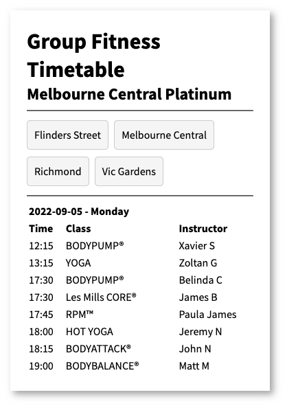

# Gym Timetable

An AWS Lambda function that can fetch the Fitness First group fitness timetable, and render it using a very simple table layout.

## Screenshot

The layout is relatively mobile-friendly. This is what it looks like on a mobile device:

## Usage

For local testing, run:

    yarn start

To run `eslint`:

    yarn lint

## License

You are free to do whatever you like with this code.
